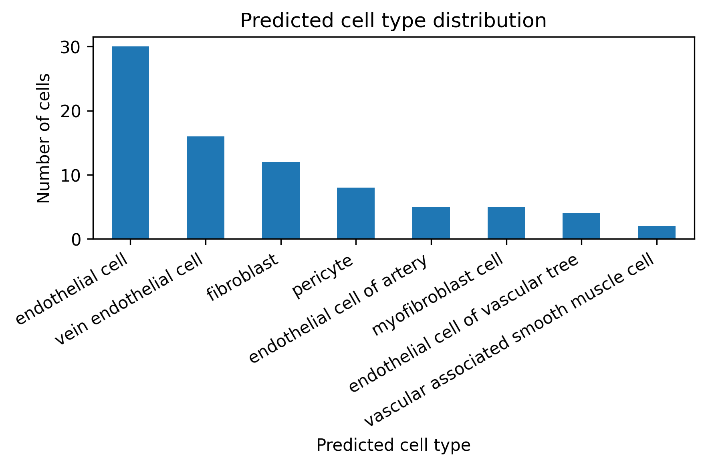
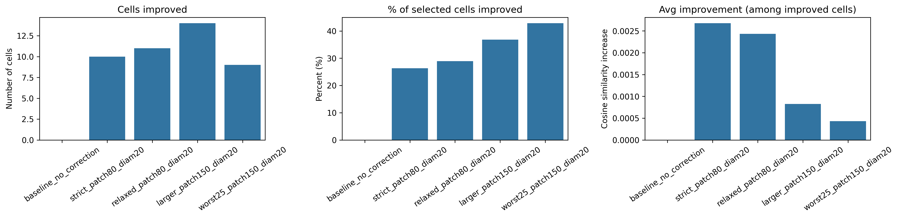
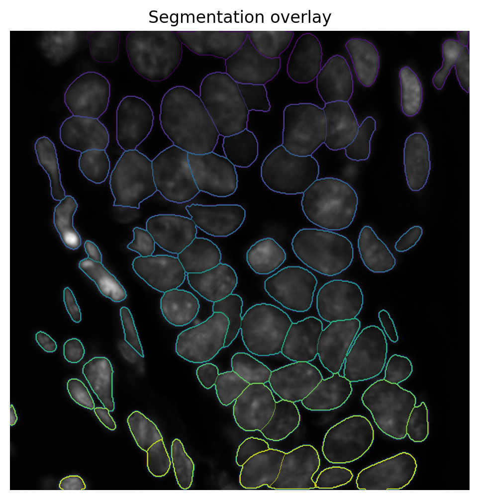
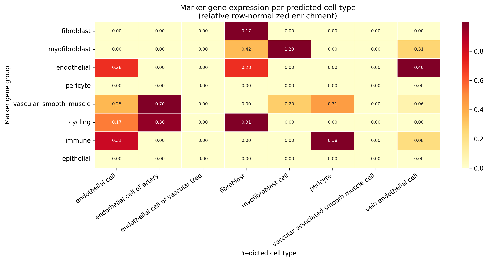
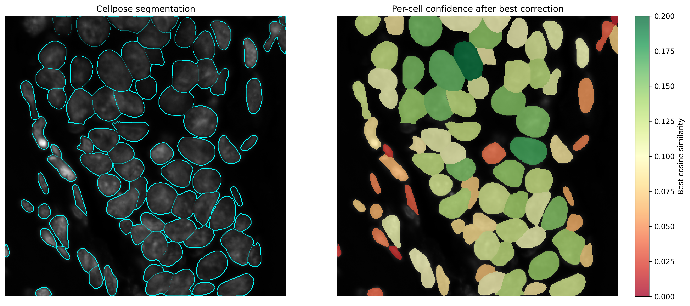
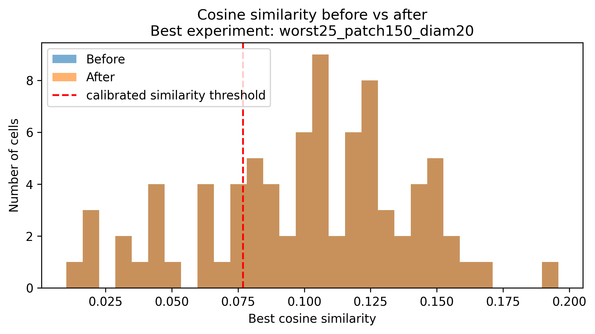

# Spatial Transcriptomics: Cellpose + Cosine Prototype Pipeline

This project builds a baseline pipeline for spatial transcriptomics on a human breast cancer Xenium dataset. Cellpose segments cells from morphology images; cosine similarity against scRNA-seq-derived prototypes assigns each cell a biological identity.

In practice this separation breaks down: segmentation errors propagate directly into misclassification, and a sparse gene panel compresses all similarity scores toward zero, making assignments systematically ambiguous. We show this empirically and implement a post-processing ablation that uses biological signal as feedback to identify and selectively re-segment low-confidence cells.

## Pipeline overview

```
breast_reference.h5ad ──► 01_build_prototypes  ──► prototypes_normalized.csv
                                                            │
morphology_focus/     ──► 02_assign_transcripts ──► cell_expression_aligned.csv
transcripts.zarr      ──►  (Cellpose + transcript assignment)
                                                            │
                                                            ▼
                          03_cosine_similarity  ──► cell_type_predictions.csv
                                                            │
                                                            ▼
                          04_evaluation_and_ablation
                               ──► refined predictions + QC figures + ablation metrics
```

## Key findings

**Gene space:** Of 8,456 Xenium panel genes and 37,361 scRNA-seq genes, **5,054 were shared** — the working gene space for all downstream comparisons. This overlap sounds large in absolute terms, but represents only ~14% of the scRNA-seq transcriptome, stripping out most of the discriminative signal that distinguishes cell types in the reference.

**Reference cell types:** 8 cell types were retained from the scRNA-seq reference (those with ≥ 1,000 cells): endothelial cell, endothelial cell of artery, endothelial cell of vascular tree, fibroblast, myofibroblast cell, pericyte, vascular associated smooth muscle cell, and vein endothelial cell.

**Segmentation:** Cellpose detected **82 cells** in the 512×512 centre crop. Of 116,364 transcripts in the crop region, **78,588 (67.5%) were assigned to a cell**; 37,776 fell outside all segmented masks. After filtering to shared genes, 74,005 transcripts were used to build the cell × gene expression matrix.

**Cosine similarity:** Best-match scores ranged from roughly **0.07–0.15**, with a **median of 0.104**. This is far below what typical dense-panel pipelines achieve. The margin between the top two cell-type matches was near zero for most cells, making assignments inherently ambiguous regardless of threshold.


**Predicted cell type distribution:**

| Predicted cell type | Cells |
|---|---|
| endothelial cell | 30 |
| vein endothelial cell | 16 |
| fibroblast | 12 |
| pericyte | 8 |
| endothelial cell of artery | 5 |
| myofibroblast cell | 5 |
| endothelial cell of vascular tree | 4 |
| vascular associated smooth muscle cell | 2 |



The heavy skew toward endothelial subtypes likely reflects both the stromal-vascular composition of the breast tissue region captured in the crop and the limited discriminative power of the sparse panel between closely related cell types.

**Ablation (post-processing):** Five re-segmentation strategies were tested on low-confidence cells. Each re-ran Cellpose locally around flagged cells using a smaller diameter (20 px vs 30 px) and accepted the new segmentation only if cosine similarity improved. Results varied across patch size, acceptance tolerance, and cell selection strategy — see the Results section for detail. The global shift in mean cosine similarity was modest across all experiments, consistent with a fundamental signal-limitation rather than a correctable segmentation problem.



## Results

### Segmentation



Cellpose was run on a 512×512 centre crop of the morphology image (`morphology_focus_0000.ome.tif`) with `CELL_DIAMETER=30`. 82 cells were detected. Transcript coordinates (stored in microns) were converted to pixel space using the physical pixel size (0.2125 µm/px) before assignment.

### Marker gene validation



The heatmap shows mean expression of canonical marker groups per predicted cell type. A well-calibrated classifier would show a diagonal pattern — each marker group peaking in its corresponding predicted type. The eight marker groups evaluated were: fibroblast (`COL1A1`, `COL1A2`, `DCN`, `LUM`, `PDGFRA`), myofibroblast (`ACTA2`, `TAGLN`, `MYL9`, `COL3A1`), endothelial (`PECAM1`, `VWF`, `KDR`, `RAMP2`, `ENG`), pericyte (`RGS5`, `PDGFRB`, `MCAM`, `CSPG4`), vascular smooth muscle (`ACTA2`, `MYH11`, `TAGLN`, `MYLK`), cycling (`MKI67`, `TOP2A`, `UBE2C`, `CENPF`), immune (`PTPRC`, `CD3D`, `CD3E`, `MS4A1`, `LYZ`), and epithelial (`EPCAM`, `KRT8`, `KRT18`, `KRT19`).

Several canonical markers — including `COL1A1`, `ACTA2`, and `VWF` — were absent from the shared gene set, limiting what the heatmap can confirm. 

###The degree to which the expected diagonal pattern appears, and which cell types show the clearest enrichment in their expected marker groups, should be described here after running notebook 04.

### Confidence and spatial distribution



### Cosine similarity before vs. after correction



---

## Repo structure

```
Computational-Genomics-Project/
├── notebooks/
│   ├── 01_build_prototypes.ipynb           # scRNA-seq → per-cell-type prototype profiles
│   ├── 02_assign_transcripts.ipynb         # Cellpose segmentation + transcript assignment
│   ├── 03_cosine_similarity.ipynb          # cosine similarity + cell-type labelling
│   └── 04_evaluation_and_ablation.ipynb    # validation, marker eval, ablation study
├── data/                                   # all data files — git-ignored
├── outputs/                                # figures and QC plots — git-ignored
├── requirements.txt
└── README.md
```

## Data files required

Place the [following files](https://drive.google.com/file/d/1Vd8j8MCcDgtq9qwLY5X2Z0bO2-A8-r1F/view?usp=sharing) in `data/` before running. Data files are not tracked by git.

| File | Description | Used by |
|---|---|---|
| `breast_reference.h5ad` | scRNA-seq reference (AnnData, human breast cancer, 104,032 cells × 37,361 genes) | 01 |
| `transcripts.zarr` | Xenium transcript table — 386M transcripts, 8,455 unique genes | 02 |
| `morphology_focus/` | Xenium morphology images (OME-TIFF, 74,945 × 51,265 px) | 02, 04 |

All intermediate files (`prototypes_normalized.csv`, `cell_expression_aligned.csv`, `masks_center.npy`, etc.) are generated by running the notebooks in order.

## Setup

```bash
python3 -m venv venv
source venv/bin/activate
pip install -r requirements.txt
```

Tested on Python 3.10–3.13. Cellpose GPU support requires a CUDA environment (e.g. Google Colab with GPU runtime).

Each notebook has a **Config** cell near the top — set paths there before running.

## Key parameters

| Notebook | Parameter | Value | Why |
|---|---|---|---|
| 01 | `CELL_TYPE_COL` | `cell_type` | Column name in `breast_reference.h5ad` obs |
| 01 | `MIN_CELLS_PER_TYPE` | `1,000` | Removes rare or poorly-sampled cell types; retains 8 of the original types |
| 01 | `EXCLUDE_LABELS` | `unknown`, `unclassified`, `ambiguous`, `unclear`, etc. | QC artifacts — would create spurious prototypes that steal assignments from real cell types |
| 02 | `CROP_SIZE` | `512` | Centre crop in pixels |
| 02 | `CELL_DIAMETER` | `30` | Expected cell diameter for Cellpose (pixels) |
| 02 | `MICRONS_PER_PIXEL` | `0.2125` | Xenium physical pixel size — required to align transcript coordinates (microns) with image coordinates (pixels) |
| 03 | `HEATMAP_N_CELLS` | `50` | Number of cells shown in the similarity heatmap |
| 04 | `CONFIDENCE_THRESHOLD` | `0.5` | Absolute threshold — flags 100% of cells under this panel; kept for reference only |
| 04 | `MARGIN_THRESHOLD` | `0.05` | Gap between top two prototype scores — the primary confidence signal |
| 04 | `RETRY_DIAMETER` | `20` | Smaller cell diameter used when re-segmenting low-confidence cells |

### Ablation experiment configurations

| Experiment | Patch size | Retry diameter | Accept tolerance | Cell selection |
|---|---|---|---|---|
| `baseline_no_correction` | 80 | 20 | — | 25th-percentile low-confidence (no re-seg) |
| `strict_patch80_diam20` | 80 | 20 | 1e-4 | 25th-percentile low-confidence |
| `relaxed_patch80_diam20` | 80 | 20 | 0.0 | 25th-percentile low-confidence |
| `larger_patch150_diam20` | 150 | 20 | 0.0 | 25th-percentile low-confidence |
| `worst25_patch150_diam20` | 150 | 20 | 0.0 | Bottom 25% of scores only |

## A note on cosine similarity scores

Absolute cosine scores in this pipeline are low (≈0.07–0.15, median 0.104). The shared gene space covers only 5,054 of the 37,361 genes in the scRNA-seq reference. With most transcriptomic signal absent, even a correct cell-type match produces a low score in absolute terms. **Relative comparisons (margin, rank) are more informative than absolute thresholds here.**

## Limitations

**Sparse gene panel.** 5,054 shared genes represent ~14% of the scRNA-seq transcriptome. Many canonical markers (`COL1A1`, `ACTA2`, `VWF`) are absent, compressing all similarity scores and limiting biological validation.

**No ground truth.** Without experimentally confirmed cell identities, evaluation is indirect (marker enrichment, confidence distributions). The ablation measures internal consistency, not accuracy against a gold standard.

**Single crop.** Results are from a 512×512 centre crop — 82 cells from a dataset spanning tens of thousands. Representativeness of the broader tissue is unknown.

**Segmentation–expression coupling.** Any segmentation error directly distorts the expression profile of the affected cell. This motivates the post-processing step but also limits how much it can recover.

## Background

**Cellpose** is a deep learning segmentation model that predicts a flow field pointing each pixel toward its nearest cell centre, then traces boundaries from those flows. This handles touching and overlapping cells without requiring manual parameter tuning per tissue type.

**Cosine similarity** measures the angle between two gene expression vectors, independent of their magnitude. It is the standard metric for comparing sparse, high-dimensional expression profiles.

**Coordinate system alignment.** Xenium transcript coordinates are in microns; the OME-TIFF image is in pixels. These are reconciled using the physical pixel size (0.2125 µm/pixel) before transcript assignment. Skipping this step results in zero assignments.
